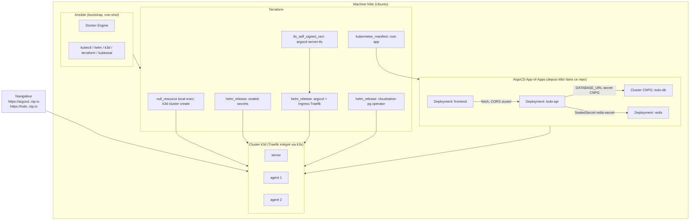

# kubernetes_poc

PoC d'infrastructure Kubernetes locale, entièrement piloté en Infrastructure as Code
(Ansible + Terraform), avec GitOps (ArgoCD) et gestion des secrets sans jamais rien
committer en clair (Sealed Secrets).

## Architecture



Les phases suivantes (voir [Roadmap](#roadmap)) brancheront CI/CD et observabilité sur
ce socle.

## Prérequis

- Ubuntu (ou dérivé Debian) avec `sudo`.
- Un utilisateur avec droits sudo interactifs (le mot de passe est demandé une seule
  fois, lors du bootstrap Ansible).

## Démarrage — Phase 1 : cluster + ArgoCD

### 1. Installer Ansible (une seule commande, à lancer toi-même)

```bash
sudo apt update && sudo apt install -y ansible
```

### 2. Lancer le bootstrap Ansible (Docker, kubectl, helm, k3d, terraform)

```bash
cd ansible
ansible-playbook playbook.yml --ask-become-pass
```

⚠️ **Si `sudo` exige une authentification interactive** (empreinte digitale ou tout
autre module PAM qui refuse un mot de passe fourni via un pipe non-interactif),
`--ask-become-pass` restera bloqué avec `Timed out waiting for become success or
become password prompt`. Dans ce cas, englobe tout le run dans un `sudo` interactif
à la place (une seule authentification réelle, au tout début) :

```bash
sudo ansible-playbook playbook.yml -e "target_user=$USER"
```

`$USER` est développé par ton shell *avant* que `sudo` ne s'exécute, donc il vaut bien
ton utilisateur normal (pas `root`) — c'est important pour que l'ajout au groupe
`docker` cible le bon compte.

⚠️ Si Docker vient d'être installé, ton utilisateur est ajouté au groupe `docker` :
**déconnecte-toi/reconnecte-toi** (ou lance `newgrp docker` dans ton shell) avant de
passer à l'étape suivante, sinon les commandes Docker/k3d échoueront par manque de
permission.

### 3. Générer le hash du mot de passe admin ArgoCD (sans jamais l'écrire en clair)

```bash
sudo apt install -y apache2-utils   # fournit htpasswd, si pas déjà présent
export TF_VAR_argocd_admin_password_hash=$(htpasswd -nbBC 10 "" 'innosys' | tr -d ':\n' | sed 's/$2y/$2a/')
```

Cette variable ne vit que dans l'environnement du shell courant — elle n'est jamais
écrite dans un fichier suivi par git.

### 4. Provisionner le cluster (deux applies, voir `terraform/providers.tf`)

Le premier apply crée uniquement le cluster k3d (pour que le kubeconfig existe avant
que les providers `kubernetes`/`helm` ne le lisent) ; le second installe Sealed Secrets
et ArgoCD dessus, avec un Ingress Traefik pour ArgoCD (accessible sans `kubectl
port-forward`).

Par défaut, l'Ingress utilise `argocd.127.0.0.1.nip.io` (accès local uniquement). Pour
y accéder depuis un autre poste du réseau, indique l'IP LAN de la machine :

```bash
cd ../terraform
terraform init
terraform apply -target=null_resource.k3d_cluster
terraform apply -var="argocd_host_ip=<IP LAN de la machine, ex: 192.168.80.169>"
```

(nip.io résout automatiquement `argocd.<IP>.nip.io` vers `<IP>`, sans toucher `/etc/hosts`.)

### 5. Vérifier

```bash
cd ..
./scripts/verify-cluster.sh
```

Puis ouvrir `https://argocd.<IP>.nip.io` (celle donnée à `argocd_host_ip`, ou
`https://argocd.127.0.0.1.nip.io` par défaut) — utilisateur `admin`, mot de passe
`innosys`. Le certificat est auto-signé (généré par Terraform, voir `terraform/ingress.tf`) :
accepter l'avertissement du navigateur.

### Détruire le cluster

```bash
cd terraform
terraform destroy
```

## Démarrage — Phase 2 : app de démo (To-Do)

App FastAPI (To-Do list) + PostgreSQL (opérateur CloudNativePG) + Redis (cache) +
frontend statique (HTML/JS servi par nginx), déployée en GitOps via un pattern ArgoCD
"App of Apps" qui lit le dossier `k8s/` de **ce dépôt**. Pas encore de CI/CD : les
images sont construites en local et importées directement dans k3d.

⚠️ ArgoCD synchronise depuis le dépôt git **distant** (`origin`), pas depuis ton disque
local : après avoir écrit/modifié les manifests, il faut les committer et les pousser
sur `main` pour qu'ArgoCD les voie.

### 1. Installer l'opérateur CloudNativePG et le bootstrap App-of-Apps

```bash
cd ansible && ansible-playbook playbook.yml --ask-become-pass   # installe kubeseal si pas déjà fait
cd ../terraform
terraform apply -var="argocd_host_ip=<IP LAN de la machine>"
```

(reprend les mêmes variables `TF_VAR_argocd_admin_password_hash` / `argocd_host_ip` que
la Phase 1 — à ré-exporter si le shell a changé depuis.)

### 2. Construire les images et les importer dans k3d

```bash
cd ../apps/todo-api
docker build -t todo-api:dev .
k3d image import todo-api:dev --cluster poc

cd ../frontend
docker build -t todo-frontend:dev .
k3d image import todo-frontend:dev --cluster poc
```

### 3. Committer et pousser les manifests

```bash
cd ../..
git add apps k8s ansible terraform README.md
git commit -m "Phase 2: app de démo To-Do (FastAPI + CNPG + Redis + frontend) en GitOps"
git push
```

ArgoCD synchronise automatiquement (`syncPolicy.automated`) dans la minute qui suit.

### 4. Vérifier

```bash
export KUBECONFIG=terraform/kubeconfig
kubectl -n todo get pods
kubectl -n todo port-forward svc/todo-api 8000:8000
```

Puis dans un autre terminal :

```bash
curl -X POST localhost:8000/todos -H "Content-Type: application/json" -d '{"title":"Tester le PoC"}'
curl localhost:8000/todos
```

Dans l'UI ArgoCD (`https://argocd.<IP>.nip.io`), les Applications `root-app`, `postgres`,
`redis`, `todo-api` et `frontend` doivent apparaître `Synced` / `Healthy`.

Tout est aussi exposé en permanence via des Ingress Traefik (même principe que ArgoCD :
certificats auto-signés scellés avec Sealed Secrets, pas de `kubectl port-forward`
nécessaire) :
- **`https://todo.<IP>.nip.io`** — l'interface web (ajouter/cocher/supprimer des tâches)
- `https://todo-api.<IP>.nip.io/docs` — Swagger de l'API
- `https://argocd.<IP>.nip.io` — UI ArgoCD

(accepter l'avertissement du navigateur pour chaque certificat auto-signé, une fois par
hostname).

## Roadmap

- **CI (GitHub Actions)** : lint (code, Dockerfiles, charts Helm), scan de sécurité des
  images avec Trivy, build/push vers GHCR, bump automatique des manifests (remplacera le
  build/import local de la Phase 2).
- **Observabilité** : Prometheus + Grafana + Loki, mot de passe admin Grafana géré lui
  aussi via Sealed Secrets (jamais en clair dans git), dashboards versionnés.
- **Déploiements avancés** : Canary / Blue-Green avec Argo Rollouts.

## Structure du dépôt

```
├── ansible/            # Bootstrap de la machine hôte (Docker, kubectl, helm, k3d, terraform, kubeseal)
├── terraform/          # Provisioning : cluster k3d, Sealed Secrets, ArgoCD, CloudNativePG, bootstrap App-of-Apps
├── apps/
│   ├── todo-api/       # Code source de l'API FastAPI (To-Do list)
│   └── frontend/       # Frontend statique (HTML/CSS/JS, servi par nginx)
├── k8s/                # Manifests GitOps : Application ArgoCD racine + apps (postgres, redis, todo-api, frontend)
└── scripts/            # Scripts d'aide (vérification en lecture seule)
```
