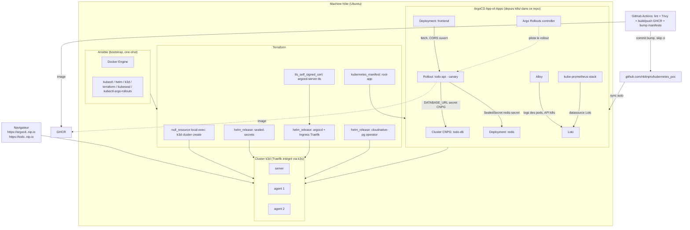

# kubernetes_poc

PoC d'infrastructure Kubernetes locale, entièrement piloté en Infrastructure as Code
(Ansible + Terraform), avec GitOps (ArgoCD), CI/CD (GitHub Actions + GHCR), déploiements
progressifs (Argo Rollouts) et gestion des secrets sans jamais rien committer en clair
(Sealed Secrets).

## Architecture



Les phases suivantes (voir [Roadmap](#roadmap)) brancheront CI/CD et observabilité sur
ce socle.

## Prérequis

- Ubuntu (ou dérivé Debian) avec `sudo`.
- Un utilisateur avec droits sudo interactifs (le mot de passe est demandé une seule
  fois, lors du bootstrap Ansible).

## Démarrage — Phase 1 : cluster + ArgoCD

### 1. Installer Ansible (une seule commande, à lancer toi-même)

```bash
sudo apt update && sudo apt install -y ansible
```

### 2. Lancer le bootstrap Ansible (Docker, kubectl, helm, k3d, terraform)

```bash
cd ansible
ansible-playbook playbook.yml --ask-become-pass
```

⚠️ **Si `sudo` exige une authentification interactive** (empreinte digitale ou tout
autre module PAM qui refuse un mot de passe fourni via un pipe non-interactif),
`--ask-become-pass` restera bloqué avec `Timed out waiting for become success or
become password prompt`. Dans ce cas, englobe tout le run dans un `sudo` interactif
à la place (une seule authentification réelle, au tout début) :

```bash
sudo ansible-playbook playbook.yml -e "target_user=$USER"
```

`$USER` est développé par ton shell *avant* que `sudo` ne s'exécute, donc il vaut bien
ton utilisateur normal (pas `root`) — c'est important pour que l'ajout au groupe
`docker` cible le bon compte.

⚠️ Si Docker vient d'être installé, ton utilisateur est ajouté au groupe `docker` :
**déconnecte-toi/reconnecte-toi** (ou lance `newgrp docker` dans ton shell) avant de
passer à l'étape suivante, sinon les commandes Docker/k3d échoueront par manque de
permission.

### 3. Générer le hash du mot de passe admin ArgoCD (sans jamais l'écrire en clair)

```bash
sudo apt install -y apache2-utils   # fournit htpasswd, si pas déjà présent
export TF_VAR_argocd_admin_password_hash=$(htpasswd -nbBC 10 "" 'innosys' | tr -d ':\n' | sed 's/$2y/$2a/')
```

Cette variable ne vit que dans l'environnement du shell courant — elle n'est jamais
écrite dans un fichier suivi par git.

### 4. Provisionner le cluster (deux applies, voir `terraform/providers.tf`)

Le premier apply crée uniquement le cluster k3d (pour que le kubeconfig existe avant
que les providers `kubernetes`/`helm` ne le lisent) ; le second installe Sealed Secrets
et ArgoCD dessus, avec un Ingress Traefik pour ArgoCD (accessible sans `kubectl
port-forward`).

Par défaut, l'Ingress utilise `argocd.127.0.0.1.nip.io` (accès local uniquement). Pour
y accéder depuis un autre poste du réseau, indique l'IP LAN de la machine :

```bash
cd ../terraform
terraform init
terraform apply -target=null_resource.k3d_cluster
terraform apply -var="argocd_host_ip=<IP LAN de la machine, ex: 192.168.80.169>"
```

(nip.io résout automatiquement `argocd.<IP>.nip.io` vers `<IP>`, sans toucher `/etc/hosts`.)

### 5. Vérifier

```bash
cd ..
./scripts/verify-cluster.sh
```

Puis ouvrir `https://argocd.<IP>.nip.io` (celle donnée à `argocd_host_ip`, ou
`https://argocd.127.0.0.1.nip.io` par défaut) — utilisateur `admin`, mot de passe
`innosys`. Le certificat est auto-signé (généré par Terraform, voir `terraform/ingress.tf`) :
accepter l'avertissement du navigateur.

### Détruire le cluster

```bash
cd terraform
terraform destroy
```

## Démarrage — Phase 2 : app de démo (To-Do)

App FastAPI (To-Do list) + PostgreSQL (opérateur CloudNativePG) + Redis (cache) +
frontend statique (HTML/JS servi par nginx), déployée en GitOps via un pattern ArgoCD
"App of Apps" qui lit le dossier `k8s/` de **ce dépôt**. Pas encore de CI/CD : les
images sont construites en local et importées directement dans k3d.

⚠️ ArgoCD synchronise depuis le dépôt git **distant** (`origin`), pas depuis ton disque
local : après avoir écrit/modifié les manifests, il faut les committer et les pousser
sur `main` pour qu'ArgoCD les voie.

### 1. Installer l'opérateur CloudNativePG et le bootstrap App-of-Apps

```bash
cd ansible && ansible-playbook playbook.yml --ask-become-pass   # installe kubeseal si pas déjà fait
cd ../terraform
terraform apply -var="argocd_host_ip=<IP LAN de la machine>"
```

(reprend les mêmes variables `TF_VAR_argocd_admin_password_hash` / `argocd_host_ip` que
la Phase 1 — à ré-exporter si le shell a changé depuis.)

### 2. Construire les images et les importer dans k3d

```bash
cd ../apps/todo-api
docker build -t todo-api:dev .
k3d image import todo-api:dev --cluster poc

cd ../frontend
docker build -t todo-frontend:dev .
k3d image import todo-frontend:dev --cluster poc
```

### 3. Committer et pousser les manifests

```bash
cd ../..
git add apps k8s ansible terraform README.md
git commit -m "Phase 2: app de démo To-Do (FastAPI + CNPG + Redis + frontend) en GitOps"
git push
```

ArgoCD synchronise automatiquement (`syncPolicy.automated`) dans la minute qui suit.

### 4. Vérifier

```bash
export KUBECONFIG=terraform/kubeconfig
kubectl -n todo get pods
kubectl -n todo port-forward svc/todo-api 8000:8000
```

Puis dans un autre terminal :

```bash
curl -X POST localhost:8000/todos -H "Content-Type: application/json" -d '{"title":"Tester le PoC"}'
curl localhost:8000/todos
```

Dans l'UI ArgoCD (`https://argocd.<IP>.nip.io`), les Applications `root-app`, `postgres`,
`redis`, `todo-api` et `frontend` doivent apparaître `Synced` / `Healthy`.

Tout est aussi exposé en permanence via des Ingress Traefik (même principe que ArgoCD :
certificats auto-signés scellés avec Sealed Secrets, pas de `kubectl port-forward`
nécessaire) :
- **`https://todo.<IP>.nip.io`** — l'interface web (ajouter/cocher/supprimer des tâches)
- `https://todo-api.<IP>.nip.io/docs` — Swagger de l'API
- `https://argocd.<IP>.nip.io` — UI ArgoCD

(accepter l'avertissement du navigateur pour chaque certificat auto-signé, une fois par
hostname).

## Démarrage — Phase 3 : Observabilité (Prometheus + Grafana + Loki)

kube-prometheus-stack (Prometheus + Grafana) et Loki + Grafana Alloy (logs), déployés
en GitOps comme le reste — 4 nouvelles Applications ArgoCD, aucun ajout Terraform. Mot
de passe admin Grafana généré aléatoirement et scellé via Sealed Secrets (même procédé
que Redis/TLS en Phase 2).

### 1. Committer et pousser les manifests

Rien à construire ni importer cette fois (uniquement des charts Helm publics tirés
directement par ArgoCD) :

```bash
git add k8s README.md
git commit -m "Phase 3: observabilité (kube-prometheus-stack + Loki + Alloy) en GitOps"
git push
```

ArgoCD synchronise automatiquement dans la minute qui suit (le premier sync peut
prendre quelques minutes : CRDs Prometheus Operator + téléchargement des images).

### 2. Vérifier

```bash
export KUBECONFIG=terraform/kubeconfig
kubectl -n monitoring get pods
kubectl -n argocd get applications
```

Grafana est exposé en permanence via un Ingress Traefik (même principe que les autres
services : certificat auto-signé scellé via Sealed Secrets) :
**`https://grafana.<IP>.nip.io`** — utilisateur `admin`, mot de passe généré lors de la
mise en place (communiqué une seule fois au moment de la génération ; le récupérer à
nouveau si besoin avec
`kubectl -n monitoring get secret grafana-admin-credentials -o jsonpath='{.data.admin-password}' | base64 -d`).

Dans Grafana : le dashboard **"To-Do API (namespace todo)"** doit apparaître
automatiquement (provisionné via ConfigMap, pas cliqué dans l'UI) ; l'onglet
**Explore → Loki** doit remonter les logs des pods `todo-api`/`frontend`/etc., confirmant
que le pipeline Alloy → Loki fonctionne.

## Redéployer sur une autre machine

L'IP LAN (`192.168.80.169` dans les exemples de ce README) est codée en dur dans
quelques fichiers (hostnames nip.io des Ingress, URL de l'API dans le frontend). Les
Sealed Secrets, eux, sont chiffrés pour la clé publique du contrôleur sealed-secrets
**de ce cluster précis** — ils ne se déchiffreront pas sur un nouveau cluster. Après
avoir suivi les Phases 1 à 3 sur la nouvelle machine (jusqu'à avoir un cluster + ArgoCD
+ Sealed Secrets fonctionnels) :

```bash
# 1. Remplacer l'ancienne IP par la nouvelle dans tout le dépôt (un seul point d'entrée)
./scripts/set-host-ip.sh 192.168.80.169 <nouvelle IP LAN>

# 2. Régénérer tous les Sealed Secrets contre le contrôleur du nouveau cluster
export KUBECONFIG=terraform/kubeconfig
./scripts/reseal-secrets.sh <nouvelle IP LAN>
# note les 2 mots de passe affichés (Redis, Grafana) — plus jamais réaffichés ensuite

# 3. Rebuild + réimporter les images dans le nouveau k3d (voir Phase 2, étape 2)
# 4. Committer et pousser
git add apps k8s README.md
git commit -m "Redéploiement : nouvelle IP LAN + secrets regénérés"
git push
```

ArgoCD (déjà pointé sur ce même dépôt git via `terraform/gitops.tf`) resynchronise
automatiquement une fois poussé.

## Démarrage — Phase 4 : CI/CD (GitHub Actions) + Argo Rollouts

Un workflow GitHub Actions (`.github/workflows/ci-cd.yml`) remplace désormais le
`docker build` + `k3d image import` manuel : à chaque push sur `main` (hors
changements purs de `k8s/`), il lint le code/Dockerfiles/manifests, build et scanne
(Trivy, non bloquant) les images `todo-api`/`frontend`, les pousse sur GHCR, puis met à
jour automatiquement le tag dans `k8s/todo-api/rollout.yaml` et
`k8s/frontend/deployment.yaml` (commit `[skip ci]`). ArgoCD synchronise ensuite tout
seul. `todo-api` est converti en `Rollout` (Argo Rollouts) avec une stratégie canary :
chaque nouvelle image est déployée progressivement (25% → pause → 50% → pause 30s →
100%).

### 1. Committer et pousser

```bash
cd ~/kubernetes_poc
git add .github ansible k8s README.md
git commit -m "Phase 4: CI/CD GitHub Actions + Argo Rollouts (canary) pour todo-api"
git push
```

### 2. ⚠️ Étape manuelle unique : rendre les packages GHCR publics

Après le tout premier run du workflow, les packages `todo-api` et `frontend` sont créés
**privés** par défaut sur GHCR — impossible à automatiser (pas d'API pour ça). Sans
cette étape, les pods resteront en `ImagePullBackOff`. Pour chaque package :
`github.com/nblinpro/kubernetes_poc` → onglet **Packages** → cliquer sur le package →
**Package settings** → **Change visibility** → **Public**.

### 3. Installer le plugin CLI et vérifier

```bash
cd ansible && ansible-playbook playbook.yml --ask-become-pass   # installe kubectl-argo-rollouts
export KUBECONFIG=~/kubernetes_poc/terraform/kubeconfig
kubectl -n argo-rollouts get pods
kubectl -n todo get rollout todo-api
```

Suivre un déploiement en direct (après un nouveau push, ou `workflow_dispatch` manuel
depuis l'onglet Actions de GitHub) :

```bash
kubectl argo rollouts get rollout todo-api --watch
```

La pause après le palier à 25% est indéfinie — pour continuer manuellement :

```bash
kubectl argo rollouts promote todo-api
```

## Roadmap

- **Blue-Green** : alternative à la stratégie canary actuelle sur `todo-api` (simple
  substitution du bloc `strategy` dans `k8s/todo-api/rollout.yaml`), non implémentée
  pour rester focalisé sur un seul pattern de déploiement progressif.

## Structure du dépôt

```
├── .github/workflows/  # CI/CD : lint, scan Trivy, build/push GHCR, bump manifests
├── ansible/            # Bootstrap de la machine hôte (Docker, kubectl, helm, k3d, terraform,
│                       # kubeseal, kubectl-argo-rollouts)
├── terraform/          # Provisioning : cluster k3d, Sealed Secrets, ArgoCD, CloudNativePG, bootstrap App-of-Apps
├── apps/
│   ├── todo-api/       # Code source de l'API FastAPI (To-Do list)
│   └── frontend/       # Frontend statique (HTML/CSS/JS, servi par nginx)
├── k8s/
│   ├── apps/           # Applications ArgoCD (postgres, redis, todo-api, frontend,
│   │                   # kube-prometheus-stack, loki, alloy, argo-rollouts, monitoring-config)
│   ├── todo-api/       # Rollout (canary) + Service + Ingress
│   └── monitoring/     # Secret Grafana scellé + dashboard "as code"
└── scripts/            # Scripts d'aide : vérification (lecture seule), portabilité
                        # (set-host-ip.sh, reseal-secrets.sh)
```
